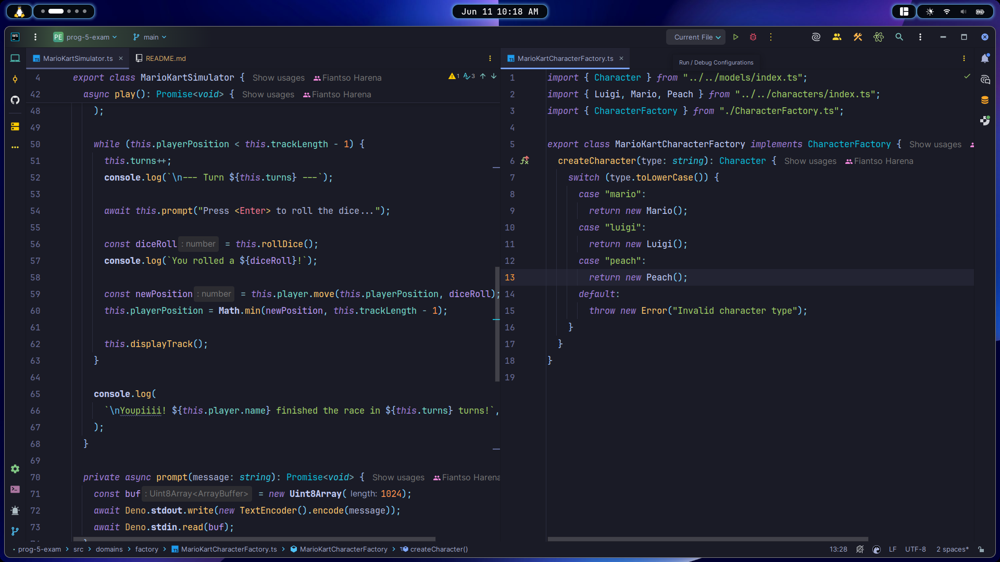

# Examen Prog-5 — Mario Kart Simulator


## 🎯 Objectif

Vous devez concevoir une **mini-simulation console** d'une course _Mario Kart_
avec les personnages les plus célèbres.\
La course se déroule sur une **ligne droite** de 20 cases, et chaque joueur
avance en fonction de ses capacités.

---

## 👾 Fonctionnalités attendues

1. 🎮 **Choix du pilote** : Le joueur peut choisir parmi 3 pilotes avec des
   caractéristiques différentes :
    - **Mario** : équilibré (vitesse 2, stabilité 2)
    - **Luigi** : lent mais très stable (vitesse 1, stabilité 3)
    - **Peach** : rapide mais instable (vitesse 3, stabilité 1)

2. 🛣️ **Simulation de la course** :
    - À chaque tour, le joueur lance un dé (1-6).
    - Sa position est mise à jour selon :
        - `nouvelle_position = position_actuelle + (vitesse * dé)`
        - Si le résultat du dé est un 6 et que la stabilité < 2, le joueur glisse :
          il ne bouge pas ce tour.

3. 🧠 **Design Pattern à appliquer** :
    - **Factory Pattern** : pour créer les personnages
    - **Builder (optionnel)** : si vous voulez personnaliser les karts (couleur,
      type, moteur…)
    - **Strategy** : pour la stratégie de déplacement selon le type de personnage
    - **State (optionnel)** : si vous modélisez des états comme “glissade”,
      “turbo”, etc.

---

## 🖥️ Installation

```bash
    git clone https://github.com/HarenaFiantso/prog-5-exam.git
    cd prog-5-exam
    deno install
    deno run main.ts
```

### 🖼️ Aperçu

<p style="margin-top: 20px; margin-bottom: 50px;">
  
</p>
